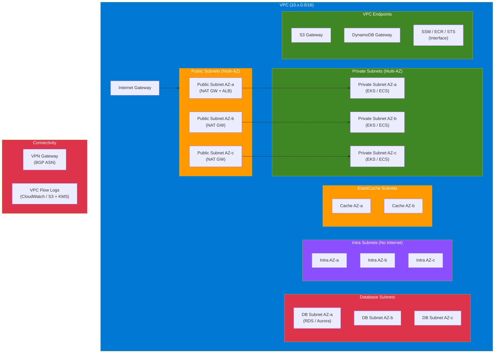

# terraform-aws-vpc-complete


A production-grade Terraform module for deploying a fully-featured AWS VPC with multi-tier subnets, NAT Gateways, VPC Flow Logs, VPC Endpoints, DHCP Options, and IPv6 dual-stack support. Designed for enterprise workloads running EKS, ECS, RDS, ElastiCache, and serverless applications.

## Architecture Diagram



## Overview

This module provisions a complete AWS Virtual Private Cloud (VPC) network topology suitable for production environments. It implements AWS Well-Architected Framework networking best practices including defense-in-depth subnet isolation, encrypted flow logging, least-privilege endpoint access, and high-availability NAT Gateway deployment.

Unlike basic VPC modules, this implementation provides five distinct subnet tiers (public, private, database, intra, and elasticache), enabling true network segmentation for multi-tier application architectures. The module supports IPv6 dual-stack networking, IPAM-based CIDR management, cross-account VPC peering, and granular flow log configuration with KMS encryption.

Every resource created by this module is tagged consistently, supports full customization via input variables, and follows the naming convention `{name}-{resource}-{identifier}` for easy identification in the AWS Console and cost allocation reports.

## Architecture

```
┌──────────────────────────────────────────────────────────────────────────────┐
│                              AWS Region                                      │
│  ┌────────────────────────────────────────────────────────────────────────┐  │
│  │                         VPC (10.x.0.0/16)                             │  │
│  │                                                                        │  │
│  │  ┌─────────────────┐  ┌─────────────────┐  ┌─────────────────┐       │  │
│  │  │   Public Sub 1a │  │   Public Sub 1b │  │   Public Sub 1c │       │  │
│  │  │   10.x.1.0/24   │  │   10.x.2.0/24   │  │   10.x.3.0/24   │       │  │
│  │  │  ┌───┐  ┌───┐   │  │  ┌───┐          │  │  ┌───┐          │       │  │
│  │  │  │NAT│  │ALB│   │  │  │NAT│          │  │  │NAT│          │       │  │
│  │  └──┴───┴──┴───┴───┘  └──┴───┴──────────┘  └──┴───┴──────────┘       │  │
│  │       │                    │                     │                     │  │
│  │  ┌────▼────────────┐  ┌───▼─────────────┐  ┌───▼─────────────┐       │  │
│  │  │  Private Sub 1a │  │  Private Sub 1b │  │  Private Sub 1c │       │  │
│  │  │  10.x.11.0/24   │  │  10.x.12.0/24   │  │  10.x.13.0/24   │       │  │
│  │  │  ┌───┐  ┌───┐   │  │  ┌───┐  ┌───┐  │  │  ┌───┐  ┌───┐  │       │  │
│  │  │  │EKS│  │ECS│   │  │  │EKS│  │ECS│  │  │  │EKS│  │ECS│  │       │  │
│  │  └──┴───┴──┴───┴───┘  └──┴───┴──┴───┴──┘  └──┴───┴──┴───┴──┘       │  │
│  │                                                                        │  │
│  │  ┌─────────────────┐  ┌─────────────────┐  ┌─────────────────┐       │  │
│  │  │ Database Sub 1a │  │ Database Sub 1b │  │ Database Sub 1c │       │  │
│  │  │  10.x.21.0/24   │  │  10.x.22.0/24   │  │  10.x.23.0/24   │       │  │
│  │  │  ┌───┐  ┌───┐   │  │  ┌───────────┐  │  │  ┌───────────┐  │       │  │
│  │  │  │RDS│  │RDS│   │  │  │  Aurora    │  │  │  │  Aurora    │  │       │  │
│  │  └──┴───┴──┴───┴───┘  └──┴───────────┴──┘  └──┴───────────┴──┘       │  │
│  │                                                                        │  │
│  │  ┌─────────────────┐  ┌─────────────────┐  ┌─────────────────┐       │  │
│  │  │  Intra Sub 1a   │  │  Intra Sub 1b   │  │  Intra Sub 1c   │       │  │
│  │  │  10.x.41.0/24   │  │  10.x.42.0/24   │  │  10.x.43.0/24   │       │  │
│  │  │  (No Internet)  │  │  (No Internet)  │  │  (No Internet)  │       │  │
│  │  └─────────────────┘  └─────────────────┘  └─────────────────┘       │  │
│  │                                                                        │  │
│  │  ┌──────────────────────────────────────────────────────────────┐     │  │
│  │  │  VPC Endpoints: S3 (GW) │ DynamoDB (GW) │ SSM │ ECR │ STS  │     │  │
│  │  └──────────────────────────────────────────────────────────────┘     │  │
│  │                                                                        │  │
│  │  ┌───────────────┐  ┌─────────────┐  ┌──────────────────────┐        │  │
│  │  │  Flow Logs     │  │  VPN GW     │  │  Internet GW         │        │  │
│  │  │  (CW/S3+KMS)  │  │  (BGP ASN)  │  │  + Egress-Only IGW   │        │  │
│  │  └───────────────┘  └─────────────┘  └──────────────────────┘        │  │
│  └────────────────────────────────────────────────────────────────────────┘  │
└──────────────────────────────────────────────────────────────────────────────┘
```

## Features

- **Multi-Tier Subnets** — Five isolated subnet tiers (public, private, database, intra, elasticache) with dedicated route tables per tier, enabling defense-in-depth network segmentation.
- **High-Availability NAT** — Deploy one NAT Gateway per AZ for fault isolation or a single shared NAT Gateway for cost optimization in non-production environments.
- **IPv6 Dual-Stack** — Amazon-provided IPv6 CIDR with auto-assignment on public subnets and Egress-Only Internet Gateway for private IPv6 outbound traffic.
- **Encrypted Flow Logs** — VPC Flow Logs to CloudWatch Logs (KMS-encrypted) or S3 (with lifecycle policies and Parquet format) with enhanced log format including traffic path and AWS service fields.
- **VPC Endpoints** — Gateway endpoints for S3 and DynamoDB (free) and interface endpoints for any AWS service with a dedicated security group allowing HTTPS from the VPC CIDR only.
- **Custom DHCP Options** — Configure internal DNS domain, custom name servers, and NTP servers for hybrid environments.
- **Default Resource Lockdown** — Default security group is managed with no ingress/egress rules, preventing accidental use.
- **IPAM Integration** — Sub-module for AWS VPC IPAM to centrally plan and allocate IP addresses across your organization.
- **VPC Peering** — Sub-module for same-region, cross-region, and cross-account VPC peering with automatic route table updates and DNS resolution.
- **DB and Cache Subnet Groups** — Automatically creates `aws_db_subnet_group` and `aws_elasticache_subnet_group` for RDS/Aurora and ElastiCache deployments.

## Prerequisites

- Terraform >= 1.5.0
- AWS Provider >= 5.20.0
- An AWS account with permissions to create VPC, subnet, NAT Gateway, VPN Gateway, KMS, IAM, S3, CloudWatch, and VPC Endpoint resources.

### Required IAM Permissions

The IAM principal running Terraform needs the following permissions (or use `AdministratorAccess` for initial setup):

```json
{
  "Version": "2012-10-17",
  "Statement": [
    {
      "Effect": "Allow",
      "Action": [
        "ec2:*Vpc*", "ec2:*Subnet*", "ec2:*RouteTable*", "ec2:*Route*",
        "ec2:*InternetGateway*", "ec2:*NatGateway*", "ec2:*Address*",
        "ec2:*SecurityGroup*", "ec2:*NetworkAcl*", "ec2:*FlowLog*",
        "ec2:*VpnGateway*", "ec2:*DhcpOptions*", "ec2:*VpcEndpoint*",
        "ec2:CreateTags", "ec2:DeleteTags", "ec2:Describe*",
        "logs:*", "s3:*", "kms:*", "iam:*Role*", "iam:*Policy*",
        "elasticache:*SubnetGroup*", "rds:*SubnetGroup*"
      ],
      "Resource": "*"
    }
  ]
}
```

## Usage

### Minimal Configuration

```hcl
module "vpc" {
  source = "github.com/kogunlowo123/terraform-aws-vpc-complete"

  name       = "my-vpc"
  cidr_block = "10.0.0.0/16"

  availability_zones   = ["us-east-1a", "us-east-1b"]
  public_subnet_cidrs  = ["10.0.1.0/24", "10.0.2.0/24"]
  private_subnet_cidrs = ["10.0.11.0/24", "10.0.12.0/24"]

  tags = {
    Environment = "dev"
  }
}
```

### Production Configuration

```hcl
module "vpc" {
  source = "github.com/kogunlowo123/terraform-aws-vpc-complete"

  name        = "prod-vpc"
  cidr_block  = "10.100.0.0/16"
  enable_ipv6 = true

  availability_zones       = ["us-east-1a", "us-east-1b", "us-east-1c"]
  public_subnet_cidrs      = ["10.100.1.0/24", "10.100.2.0/24", "10.100.3.0/24"]
  private_subnet_cidrs     = ["10.100.11.0/24", "10.100.12.0/24", "10.100.13.0/24"]
  database_subnet_cidrs    = ["10.100.21.0/24", "10.100.22.0/24", "10.100.23.0/24"]
  intra_subnet_cidrs       = ["10.100.41.0/24", "10.100.42.0/24", "10.100.43.0/24"]

  enable_nat_gateway = true
  single_nat_gateway = false

  enable_flow_logs          = true
  flow_log_destination_type = "s3"
  flow_log_retention_days   = 365

  enable_s3_endpoint       = true
  enable_dynamodb_endpoint = true

  private_subnet_tags = {
    "kubernetes.io/role/internal-elb" = "1"
  }

  tags = {
    Environment = "production"
    ManagedBy   = "terraform"
  }
}
```

## Module Inputs

| Name | Description | Type | Default | Required |
|------|-------------|------|---------|----------|
| `name` | Name prefix for all resources | `string` | n/a | yes |
| `cidr_block` | Primary IPv4 CIDR block for the VPC | `string` | n/a | yes |
| `availability_zones` | List of AZs to deploy subnets into | `list(string)` | n/a | yes |
| `secondary_cidr_blocks` | Additional IPv4 CIDR blocks | `list(string)` | `[]` | no |
| `enable_ipv6` | Enable IPv6 dual-stack | `bool` | `false` | no |
| `instance_tenancy` | VPC instance tenancy (default/dedicated) | `string` | `"default"` | no |
| `enable_dns_support` | Enable DNS resolution | `bool` | `true` | no |
| `enable_dns_hostnames` | Enable DNS hostnames | `bool` | `true` | no |
| `public_subnet_cidrs` | CIDR blocks for public subnets | `list(string)` | `[]` | no |
| `private_subnet_cidrs` | CIDR blocks for private subnets | `list(string)` | `[]` | no |
| `database_subnet_cidrs` | CIDR blocks for database subnets | `list(string)` | `[]` | no |
| `intra_subnet_cidrs` | CIDR blocks for intra subnets (no internet) | `list(string)` | `[]` | no |
| `elasticache_subnet_cidrs` | CIDR blocks for ElastiCache subnets | `list(string)` | `[]` | no |
| `enable_nat_gateway` | Enable NAT Gateway(s) | `bool` | `true` | no |
| `single_nat_gateway` | Use single NAT Gateway for all AZs | `bool` | `false` | no |
| `enable_vpn_gateway` | Create VPN Gateway | `bool` | `false` | no |
| `vpn_gateway_asn` | Amazon-side ASN for VPN Gateway | `number` | `64512` | no |
| `enable_flow_logs` | Enable VPC Flow Logs | `bool` | `true` | no |
| `flow_log_destination_type` | Flow log destination (cloud-watch-logs/s3) | `string` | `"cloud-watch-logs"` | no |
| `flow_log_retention_days` | Flow log retention in days | `number` | `30` | no |
| `flow_log_max_aggregation_interval` | Aggregation interval (60/600 seconds) | `number` | `600` | no |
| `enable_s3_endpoint` | Create S3 Gateway Endpoint | `bool` | `true` | no |
| `enable_dynamodb_endpoint` | Create DynamoDB Gateway Endpoint | `bool` | `false` | no |
| `interface_endpoints` | Map of interface VPC endpoints to create | `map(object)` | `{}` | no |
| `enable_dhcp_options` | Create custom DHCP options | `bool` | `false` | no |
| `dhcp_domain_name` | DNS domain for DHCP options | `string` | `""` | no |
| `dhcp_domain_name_servers` | DNS servers for DHCP options | `list(string)` | `["AmazonProvidedDNS"]` | no |
| `dhcp_ntp_servers` | NTP servers for DHCP options | `list(string)` | `[]` | no |
| `manage_default_security_group` | Lock down default security group | `bool` | `true` | no |
| `manage_default_network_acl` | Manage default network ACL | `bool` | `true` | no |
| `create_database_subnet_group` | Create DB subnet group | `bool` | `true` | no |
| `public_subnet_tags` | Additional tags for public subnets | `map(string)` | `{}` | no |
| `private_subnet_tags` | Additional tags for private subnets | `map(string)` | `{}` | no |
| `database_subnet_tags` | Additional tags for database subnets | `map(string)` | `{}` | no |
| `tags` | Tags to apply to all resources | `map(string)` | `{}` | no |

## Module Outputs

| Name | Description |
|------|-------------|
| `vpc_id` | The ID of the VPC |
| `vpc_arn` | The ARN of the VPC |
| `vpc_cidr_block` | The primary CIDR block of the VPC |
| `vpc_ipv6_cidr_block` | The IPv6 CIDR block of the VPC |
| `public_subnet_ids` | List of public subnet IDs |
| `public_subnet_cidr_blocks` | List of public subnet CIDR blocks |
| `private_subnet_ids` | List of private subnet IDs |
| `private_subnet_cidr_blocks` | List of private subnet CIDR blocks |
| `database_subnet_ids` | List of database subnet IDs |
| `database_subnet_group_name` | Name of the DB subnet group |
| `intra_subnet_ids` | List of intra subnet IDs |
| `elasticache_subnet_ids` | List of ElastiCache subnet IDs |
| `elasticache_subnet_group_name` | Name of the ElastiCache subnet group |
| `public_route_table_id` | ID of the public route table |
| `private_route_table_ids` | List of private route table IDs |
| `nat_gateway_ids` | List of NAT Gateway IDs |
| `nat_gateway_public_ips` | List of NAT Gateway public IPs |
| `internet_gateway_id` | ID of the Internet Gateway |
| `vpn_gateway_id` | ID of the VPN Gateway |
| `s3_endpoint_id` | ID of the S3 VPC Endpoint |
| `flow_log_id` | ID of the VPC Flow Log |

## Examples

- [Basic](./examples/basic) — Simple 2-tier VPC with single NAT Gateway
- [Advanced](./examples/advanced) — 3-AZ VPC with all subnet tiers, multi-AZ NAT, and VPC endpoints
- [Complete](./examples/complete) — Enterprise VPC with IPv6, VPN, interface endpoints, and full security controls
- [IPv6 Dual-Stack](./examples/ipv6-dual-stack) — IPv6-enabled VPC

## Sub-modules

| Module | Description |
|--------|-------------|
| [ipam](./modules/ipam) | AWS VPC IPAM for centralized IP address management |
| [vpc-peering](./modules/vpc-peering) | VPC peering with cross-account and cross-region support |
| [flow-logs](./modules/flow-logs) | Standalone flow log configuration for VPC, subnet, or ENI |

## Security Considerations

- **Default Security Group**: Managed with no rules to prevent accidental use. Create explicit security groups for all workloads.
- **Flow Logs**: Enabled by default with KMS encryption. Use 60-second aggregation for security-sensitive environments.
- **NAT Gateway**: Deploy one per AZ in production for fault isolation. Single NAT is acceptable for dev/staging.
- **VPC Endpoints**: Use gateway endpoints (S3, DynamoDB) to avoid data transfer charges. Use interface endpoints for services accessed from private subnets.
- **IMDSv2**: This module does not create EC2 instances, but subnets are configured to support IMDSv2-enforced instances.
- **IPv6**: When enabled, public subnets auto-assign IPv6 addresses. Ensure security groups and NACLs account for IPv6 traffic.

## Cost Estimation

| Resource | Approximate Monthly Cost (us-east-1) |
|----------|--------------------------------------|
| VPC | Free |
| Public Subnets | Free |
| NAT Gateway (per AZ) | ~$32 + $0.045/GB processed |
| VPN Gateway | ~$36 |
| S3 Gateway Endpoint | Free |
| DynamoDB Gateway Endpoint | Free |
| Interface VPC Endpoint (per AZ) | ~$7.20 |
| VPC Flow Logs (CloudWatch) | $0.50/GB ingested |
| VPC Flow Logs (S3) | S3 storage costs |
| KMS Key | $1/month + $0.03/10K requests |

## References

- [AWS VPC Documentation](https://docs.aws.amazon.com/vpc/latest/userguide/)
- [VPC Subnet Sizing](https://docs.aws.amazon.com/vpc/latest/userguide/configure-subnets.html)
- [NAT Gateway Best Practices](https://docs.aws.amazon.com/vpc/latest/userguide/vpc-nat-gateway.html)
- [VPC Flow Logs](https://docs.aws.amazon.com/vpc/latest/userguide/flow-logs.html)
- [VPC Endpoints](https://docs.aws.amazon.com/vpc/latest/privatelink/vpc-endpoints.html)
- [AWS IPAM](https://docs.aws.amazon.com/vpc/latest/ipam/what-it-is-ipam.html)
- [Terraform AWS Provider - VPC Resources](https://registry.terraform.io/providers/hashicorp/aws/latest/docs/resources/vpc)

## Contributing

1. Fork the repository
2. Create a feature branch (`git checkout -b feature/my-feature`)
3. Commit your changes (`git commit -m 'feat: add new feature'`)
4. Push to the branch (`git push origin feature/my-feature`)
5. Open a Pull Request

Please ensure all Terraform code passes `terraform fmt`, `terraform validate`, and `tflint` before submitting.

## License

MIT License - see [LICENSE](./LICENSE) for details.
